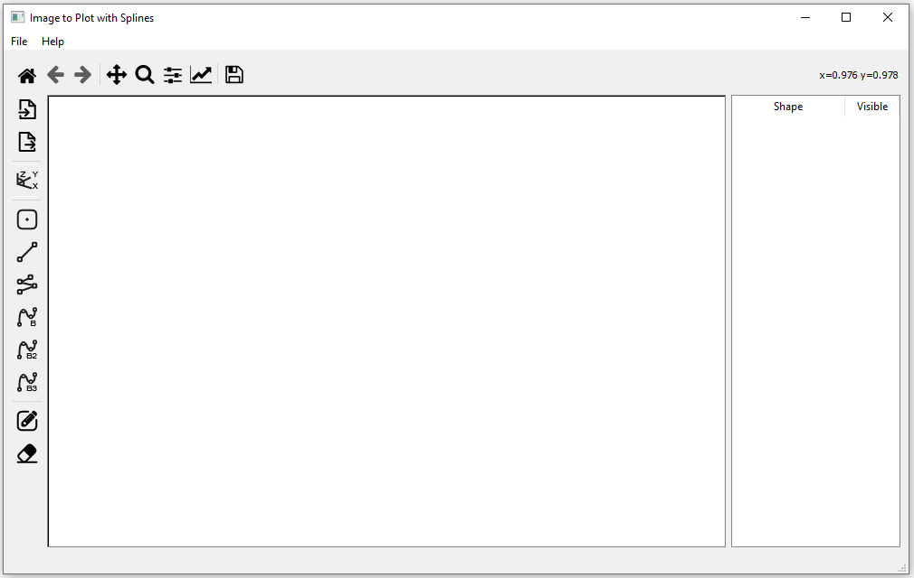
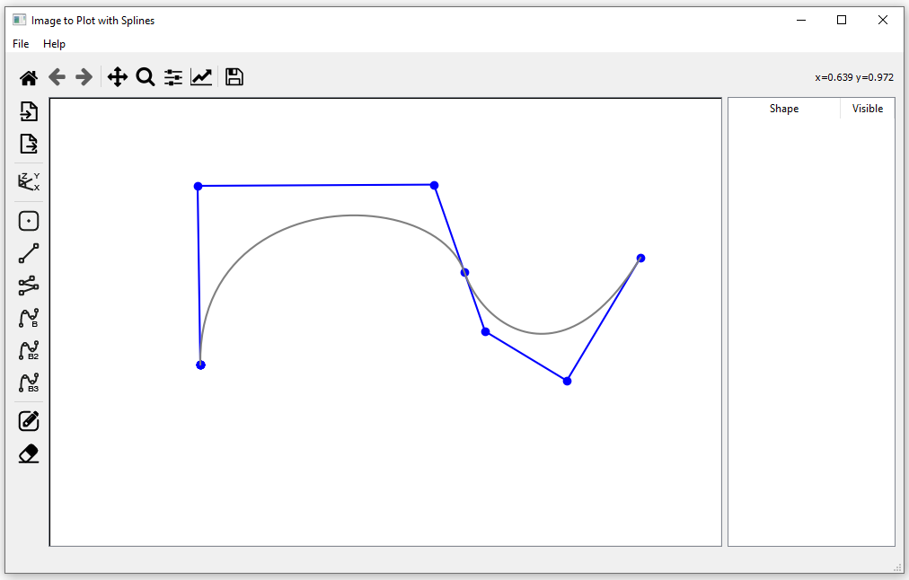
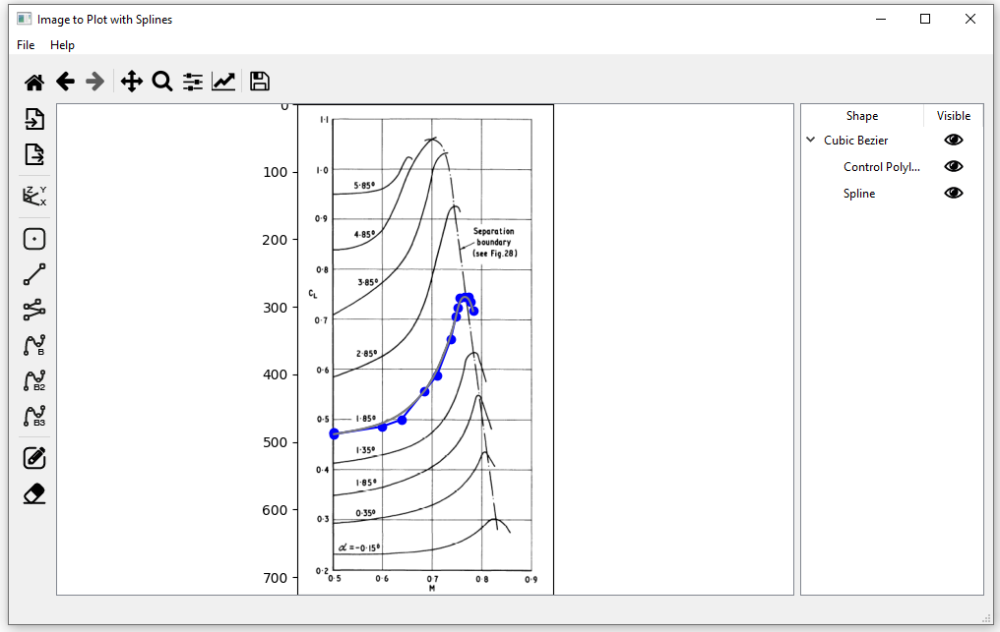
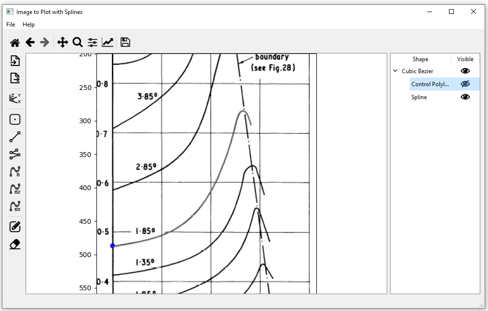

# Image To Plot

Image to plot is an application developed to ease the process of getting data from plot images. It contains a user friendly environment and makes use of composite Bezier splines in order to get infinite smooth and precise data from images.

## User Interface

The User Interface consists of the Canvas (in which the user works mostly adding and editing axis systems, points and splines),
the Toolbar (used for navigation in Canvas), the Custom Toolbar (which consists of the primary tools), the Shapes Tree View 
(which includes all the entities added in Canvas) and the Menu Bar.

  

The user can add splines with the desired number of Control Points, from which he can control it.

  

With the use of splines, the graph of the image can be approached with very few Control Points with excellent precision,
whereas the user can export as many points of the graph as he wishes.

  

  

## Requirements

* Numpy
* Matplotlib
* numerical-analysis
